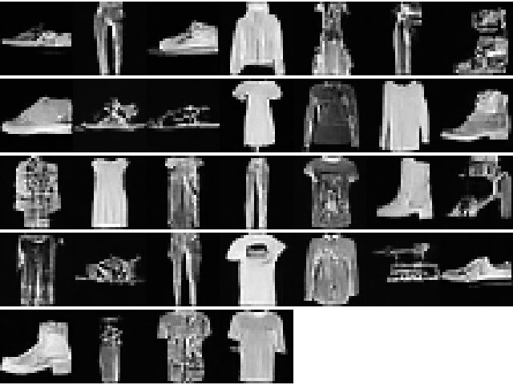

# Denoising Diffusion Probabilistic Models

---

## Usage

### training

```python
from module.unet import UNet
from module.ddpm import DDPM
from trainer import train
from util.data import fashion_mnist_data_loader

if __name__ == '__main__':
    model = UNet(
        in_feature=1,
        num_features=64,
        multi=[1, 2, 4],
        shape=(1, 28, 28)
    )
    ddpm = DDPM(
        model,
        T=1000,
        d=100,
        beta=(1e-4, 0.02)
    )
    train_loader = fashion_mnist_data_loader("./dataset/", batch_size=64, train=True, num_workers=4)
    test_loader = fashion_mnist_data_loader("./dataset/", batch_size=64, train=False, num_workers=4)
    train(ddpm, train_loader, test_loader, epochs=100)
```

### generate

```python
import torch
import torchvision

from module.ddpm import DDPM
from module.unet import UNet
from trainer import Diffusion

if __name__ == '__main__':
    model = UNet(
        in_feature=1,
        num_features=64,
        multi=[1, 2, 4],
        shape=(1, 28, 28)
    )  # same as training
    ddpm = DDPM(
        model,
        T=1000,
        d=100,
        beta=(1e-4, 0.02)
    )  # same as training
    device = torch.device("cuda:0" if torch.cuda.is_available() else "cpu")
    diffusion: Diffusion = Diffusion.load_from_checkpoint(r'lightning_logs/version_2/checkpoints/epoch=36-step=34706.ckpt', ddpm=ddpm)
    tensor4d = diffusion.ddpm.sample(32, shape=(1, 28, 28), device=device)
    grid = torchvision.utils.make_grid(tensor4d)
    torchvision.utils.save_image(grid, r'generate.png')
```

### Monitor Training

`tensorboard --logdir=./lightning_logs`

---

## Result

### 1. Fashion MNIST

(about 30 minutes)



### 2. CIFAR10

(Result is bad TAT)

### 3. CelebA

(10 epoch 50k steps, 1 epoch cost about 1 hour, generate 32x image cost 2-3 minutes)  


---

## Experiment params

**RTX3050 4GB**

|    dataset    |  img size   | num features |    multi     | dropout | batch size |
|:-------------:|:-----------:|:------------:|:------------:|:-------:|:----------:|
| Fashion MNIST | (1, 28, 28) |      64      |  [1, 2, 4]   |    0    |     64     |
|    CIFAR10    | (3, 32, 32) |     128      | [1, 2, 4, 8] |         |            |
|    CelebA     | (3, 64, 64) |     128      | [1, 2, 4, 8] |   0.1   |     32     |

